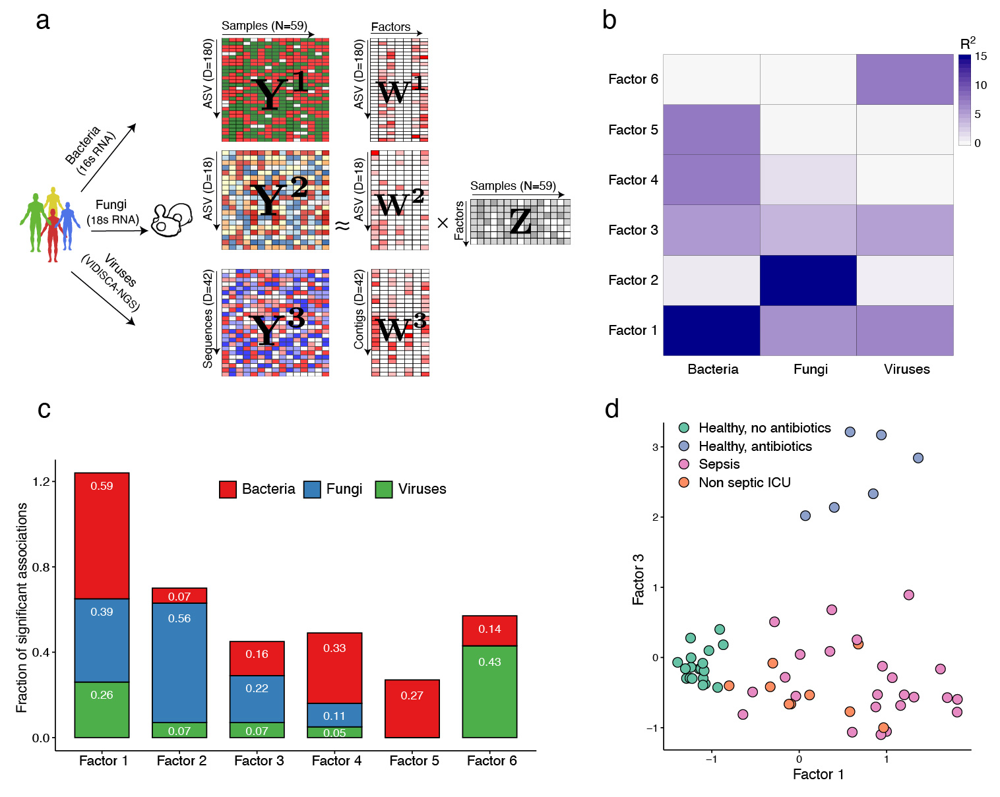

# Integrative transkingdom analysis of the gut microbiome in antibiotic perturbation and critical illness

This repository contains the scripts to reproduce the results of the manuscript [Integrative transkingdom analysis of the gut microbiome in antibiotic perturbation and critical illness](https://www.biorxiv.org/node/1386482.full).  

Abstract
--------
While numerous studies have characterized antibiotic-induced disruptions of the bacterial microbiome, few studies describe how these disruptions impact the composition of other kingdoms, such as viruses, fungi and protozoa. To address this knowledge gap, we employed  MOFA+  to systematically integrate viral, fungal and bacterial sequence data from critically ill patients (with and without sepsis) and healthy volunteers, both prior to and following exposure to broad-spectrum antibiotics. In doing so, we show that modulation of the bacterial component of the microbiome has implications extending beyond this kingdom alone, enabling the overgrowth of potentially invasive fungi and viruses. 

 

Vignette
--------
A vignette is provided in the [MOFA tutorials section](https://raw.githack.com/bioFAM/MOFA2_tutorials/master/R_tutorials/microbiome_vignette.html)

Data
-------
The raw data is accessible at ENA ([PRJEB37289](xx)). 
For links to the parsed data and the pre-computed MOFA model, see the vignette above

Contact
-------
* Bas Haak (b.w.haak@amsterdamumc.nl)
* Ricard Argelaguet (ricard@ebi.ac.uk)

